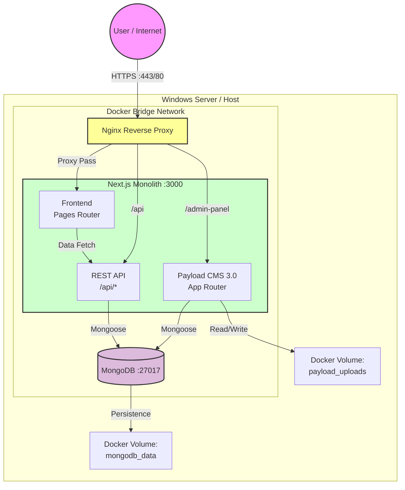
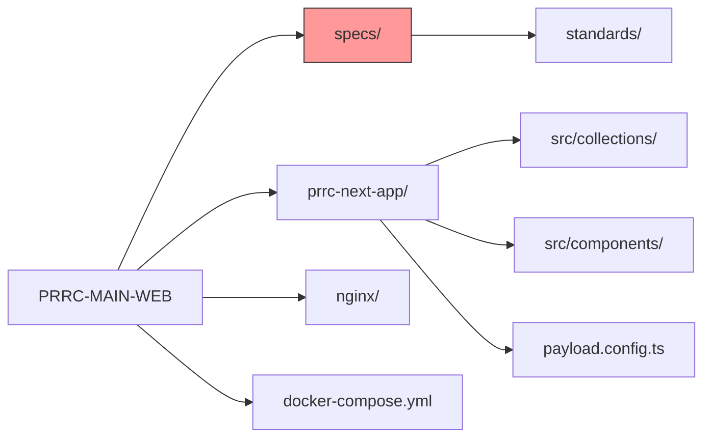

# Visual Monolith: PRRC System Architecture

## System Topography
This diagram represents the single source of truth for the PRRC containerized environment.

## Directory Map
High-level mapping of the monolithic repository structure.

---

## Script Execution Guidelines for AI Agents

When executing commands or scripts, AI agents must follow these protocols:

1. **Background Execution**: Run long-running processes in detached mode to prevent blocking
2. **Log Monitoring**: Check output in the `logs/` directory rather than waiting for direct output
3. **Timeout Prevention**: Use appropriate timeout mechanisms to avoid hanging processes
4. **Available Scripts**: Use the logging versions of scripts (e.g., `generate:types:log`) when available