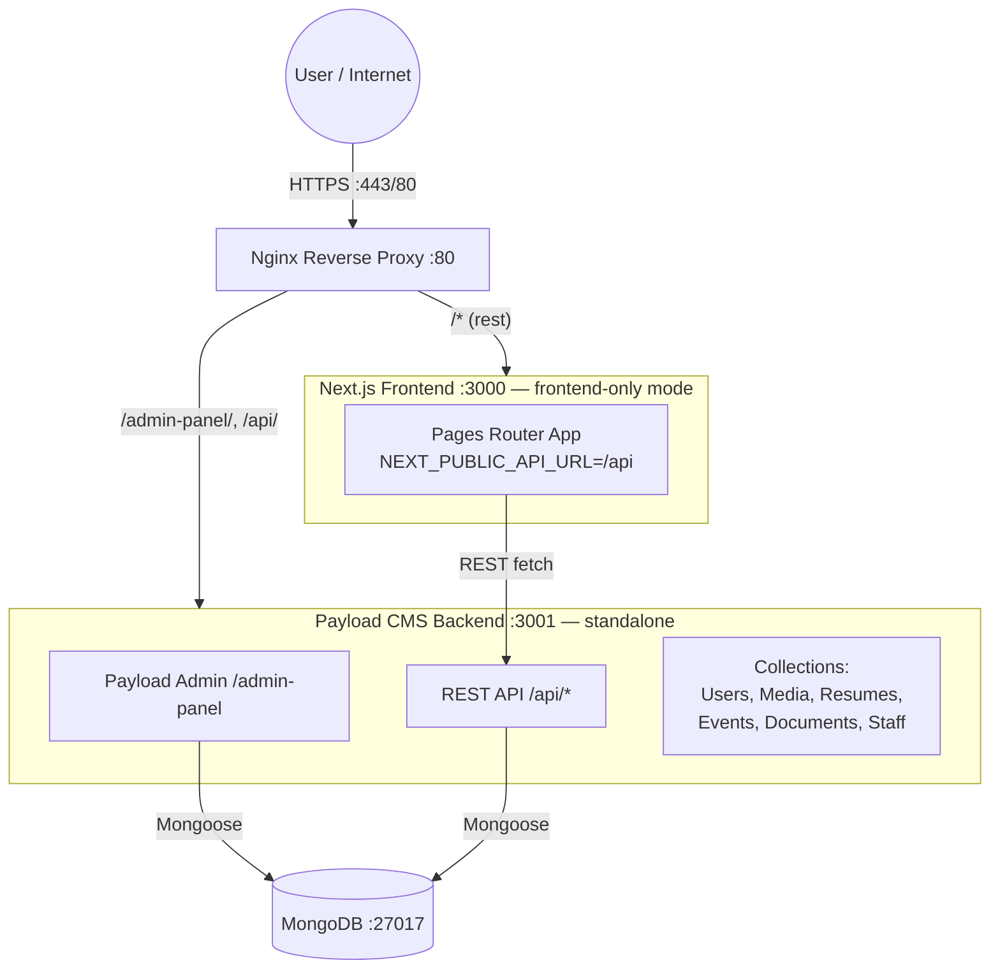
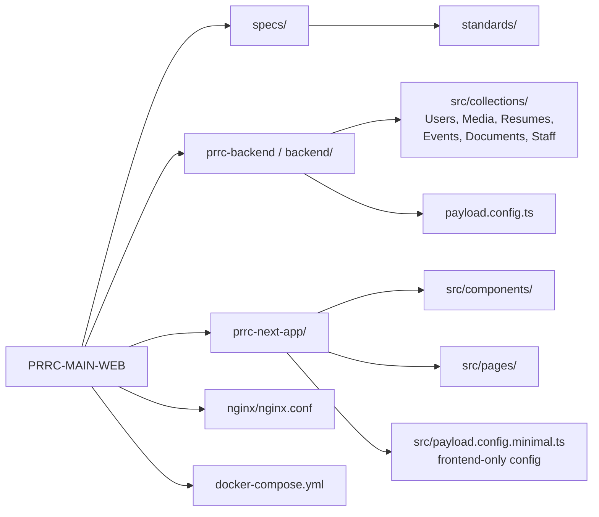

# PRRC System Architecture — Split Backend / Frontend

> **Source of truth** per `specs/doc_policy.md`. Reflects the standalone-backend
> split (Phase 2); previously a single monolith.

## System Topography
Two services behind an Nginx reverse proxy. The Payload backend owns every
collection and the database; the Next.js frontend is a "frontend-only" client
that fetches data over REST.

### Routing (`nginx/nginx.conf`)
| Path | Proxies to | Service |
|---|---|---|
| `/admin-panel/` | `payload-backend:3001/admin-panel/` | Payload admin UI |
| `/api/` | `payload-backend:3001/api/` | REST API |
| `/*` (all else) | `nextjs-frontend:3000` | Next.js frontend |

## Directory Map

## Data Flow
- **Frontend** (`prrc-next-app`) runs in frontend-only mode:
  `src/payload.config.minimal.ts` loads no collections, so the app ships small
  and never touches MongoDB directly.
- All data is fetched at runtime via REST using `NEXT_PUBLIC_API_URL`
  (`/api` in production through nginx; `http://localhost:3001` in local dev).
- **Backend** (`prrc-backend`) is a standalone Payload CMS service. It owns every
  collection, the admin UI, and the MongoDB connection (`MONGODB_URI`).

## Script Execution Guidelines for AI Agents
Per `doc_policy.md` §3:
1. **Background Execution:** run long-running processes in detached mode.
2. **Log Monitoring:** read output from `logs/`, don't wait on direct output.
3. **Timeout Prevention:** use timeouts to avoid hanging processes.
4. **Available Scripts:** prefer the logging variants (e.g. `generate:types:log`).
